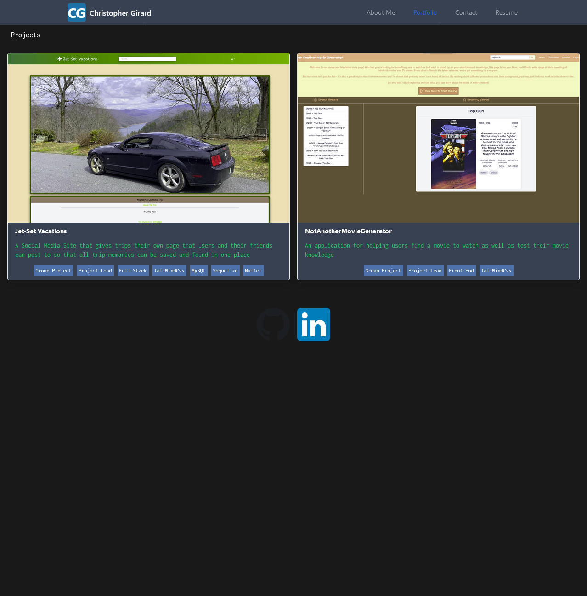

# Christopher Girard's React Single Page Portfolio Website App

## About

This is a Static Only Website for Use as my ` Profesional Portfolio ` 

## Table of Contents

- [Christopher Girard's React Single Page Portfolio Website App](#christopher-girards-react-single-page-portfolio-website-app)
  - [About](#about)
  - [Table of Contents](#table-of-contents)
  - [Description](#description)
  - [Preview](#preview)
  - [Deployment](#deployment)
  - [Installation](#installation)
  - [Tests](#tests)
  - [License](#license)

## Description

This ` Portfolop App ` is a Static Single Page application that would empower hiring managers, team leads, clients, and whoever else to view my work (both first hand with the application as well as with projects in my portfolio), resume, learn more about me, as well as get into contact with me. It was bootstrapped with Create React App specifically ` CRA_5 ` as the framework and gets packed with ` Webpack_5 ` as configured with ` CRA_5 `. The Application also uses the ` Email.js ` api to send emails to me from a static site. This application was developed to show off my front end skills as a Full-Stack Developer as well as continue to build those skill and get familiar with React before taking on ` NEXT.js `. This Application is a good starting point to continue fleshing out with my projects but also to comeback to and iterate on bringing back new skills i've learned in my future projects.

## Preview

The following Image Shows the Landing Page of the Portfolio:

        

## Deployment

[React-Portfolio](https://chriseligirard.github.io/React-Portfolio/) is deployed with Github-Pages
  
## Installation

The Application is Deployed although you are able to install it locally and mess with the application yourself.

1. To get Started you will need [Node.js](https://nodejs.org/en) if you wish to edit the app or run it in dev mode.
2. Clone The Repo Down
3. Run ` npm i ` in your terminal once you cd into the root folder of the application
4. Finally run ` npm run start ` and the server will boot up and open the default web browser to the apps local hosted port, have fun testing!
5. Once you are done editing if you'd like to pack all of your changes back into a static app just run ` npm run build `

## Tests
  
  No Tests are currently written but is supported with ` npm test ` using ` Jest `
  
## License

